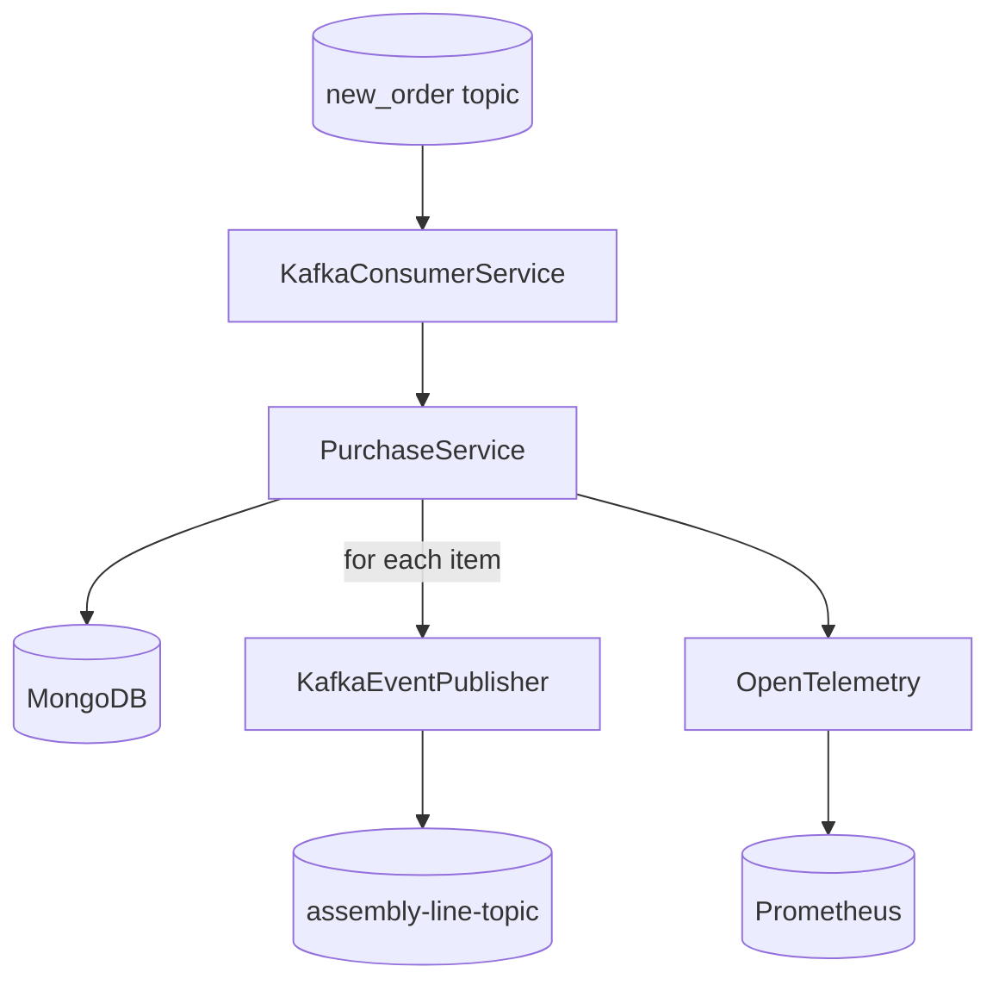

# Spring Boot Event Processor

This application consumes purchase events from Kafka, stores them in MongoDB and
emits one production event per item. Metrics are exported through OpenTelemetry
so Prometheus or Grafana can monitor the processing pipeline.

## Architecture



## Build

```bash
mvn package
```

Run the application with:

```bash
mvn spring-boot:run
```

Before the first run initialise MongoDB:

```bash
mongo < scripts/mongo-init.js
```

Metrics are available on `http://localhost:9464/metrics`. Connection properties
for Kafka and MongoDB are defined in
`src/main/resources/application.properties`.

## Continuous Integration

GitHub Actions build the project and run unit tests with JaCoCo code coverage.
The generated report is uploaded as a workflow artifact.
